author: KOIZUMI Yusuke
summary: 仮想マシン上でDNSサーバを立ち上げて、LAN内向けに名前解決を提供します
id: try-dns-server
categories: named
environments: Web
status: Publish
Feedback Link: /


# 自宅 DNS サーバの立ち上げとレコード登録

## はじめに
Duration: 0:05:00

このハンズオンでは、次の手順で DNS サーバを構築します。

1. Oracle VirtualBox の仮想マシンに AlmaLinux (CentOS の後継) をインストールします。
2. named を設定して DNS サーバとして利用可能にします。
3. 特定のドメインについての名前解決を提供します。


### 環境

以下の環境・前提条件でハンズオンを記載します。自身の状況と異なる部分は適宜読み替えてください。

- ホストOS: Windows 10
- ホスト側のマシンの仮想環境: Oracle VirtualBox 7.0
- ゲストOS: AlmaLinux 9

### 前提条件

- IP アドレスとネットワークについて知識があること。とくに
    - `192.168.0.0/20` と `192.168.0.0/24` の違いを理解していること
- 名前解決を知っていることとくに
    - `https://www.google.com/` にアクセスする際、ドメイン名 (`www.google.com`) とIPアドレスの紐づけが必要であることを理解していること
    - 上記の紐づけを担うサーバの名称を知っていること
- vim を使用してテキストファイルを編集できること

### 具体的な設定値

以下の環境・前提条件でハンズオンを記載します。自身の状況と異なる部分は適宜読み替えてください。

- Windows 10 のマシンが属するネットワークは `192.168.0.0/24` である
- DNS サーバを `192.168.0.101` に設置する
    - あなたが `192.168.0.0/24` の管理者でない場合、これができない可能性があります。
- ホスト側は `192.168.0.1` をデフォルトゲートウェイとしていて、仮想マシン側も同様に設定する。
- DNS サーバで `myserver.test` を `192.168.0.10` に解決する

<aside class="negative">
これらの設定値はネットワークの都合に合わせて適宜変更してください。
</aside>

## 仮想マシンの準備

このハンズオンでは DNS サーバを仮想マシン上に立ち上げます。そのため、まずは仮想マシンを用意しましょう。

### Oracle VirtualBox のインストール

このハンズオンでは仮想環境として Oracle VirtualBox を使用するため、そのインストールをします。

<aside class="positive">

すでに Oracle VirtualBox がインストールされている場合、この手順は不要です。
</aside>

[ダウンロードページ](https://www.virtualbox.org/wiki/Downloads)からインストーラをダウンロードできます。このハンズオンでは Windows 10 を使用している前提なので、このページの「Windows hosts」をクリックします。

インストーラーをダウンロード出来たら、そのインストーラー を使用して Oracle VirtualBox をインストールしましょう。

<aside class="positive">
ダウンロードページで拡張パックもダウンロードすることができますが、このハンズオンでは拡張パックは不要です。
</aside>

### AlmaLinux の入手

仮想マシンにインストールするOSのインストールディスクイメージを取得しましょう。

[ダウンロードページ](https://almalinux.org/ja/get-almalinux/)へアクセスします。いくつかダウンロードリンクがありますが、今回は AlmaLinux OS 9 の DVD ISO をクリックしてダウンロードします。

<aside class="positive">
サイズが大きいため時間がかかり、ネットワークが不安定な場合には失敗する確率が上がります。Torrent を使用できる場合は「.torrent ファイルをダウンロード」から入手してもかまいません。
</aside>

<aside class="negative">
Minimal ISO の方が軽く仮想マシンのディスクも小さくできますが、この ISO では最小限のインストールしかできないため、問題が発生した際の調査には Linux の専門性が必要です。また OS インストール時に DNS サーバをインストールできないため、別途インストール作業が必要となります。

一方で DVD ISO であれば GUI 付き、サーバ管理のための一連のツール付きで OS をインストールできるため、Linux のコマンドに精通していなくともこのハンズオンを進めることができます。
</aside>

### 仮想マシンの作成

Oracle VirtualBox をインストール出来たら、仮想マシンを作成しましょう。まずはあとで AlmaLinux をインストールするための空のマシンを作成します。

Oracle VirtualBox のメニューから『仮想マシン』→『新規』をクリックします（下図）。

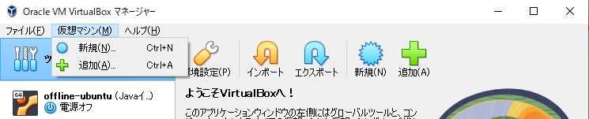

下図のウィンドウが開くため、下記の点を入力します。

- 名前は何でもよいですが、ここでは「DNS-server」としています。
- フォルダは、容量不足等の理由がなければ変更しなくて構いません。
- ISO イメージには先ほど入手した AlmaLinux のインストールディスクイメージを指定します。
- 「自動インストールをスキップ」にチェックを入れます。
    - 執筆時点で AlmaLinux 9 の自動インストールに失敗するため

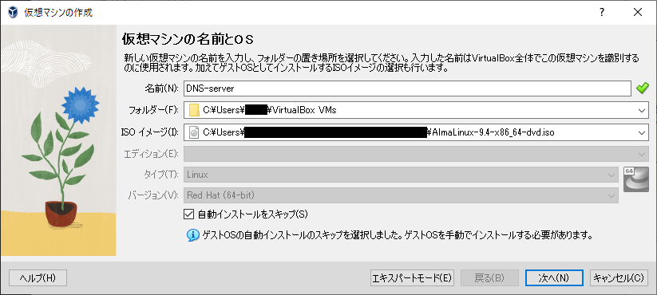

「次へ」をクリックします。その後の『ハードウェア』や『仮想ハードディスク』の設定は変更せず「次へ」をクリックしてかまいません。

ひととおり設定を選ぶと『概要』が表示されます。内容に問題が無ければ右下の「完了」をクリックすることで、仮想マシンを実際に作成します。

作成されると下図のように仮想マシン一覧に表示されます。

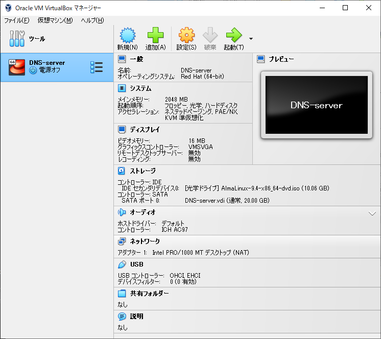

### ネットワーク設定の変更

仮想マシンが実際のネットワークに接続する方式（もしくは仮想のネットワークに接続する方式）はいくつかあります。

今回は仮想マシンにはホスト側と同じネットワークに参加させてそのIPアドレスを割り当てようとしているので、それができるように仮想マシンのネットワーク設定を変更しましょう。

先ほど表示された画面の「設定」（下図）をクリックすることで、先ほど作成した仮想マシンの設定ダイアログを開きます。

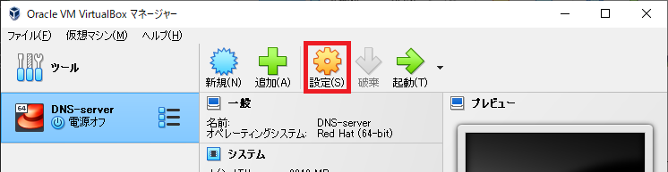

設定ダイアログが開いたら、その左側のメニューの「ネットワーク」をクリックしましょう。下図の画面が表示されます。

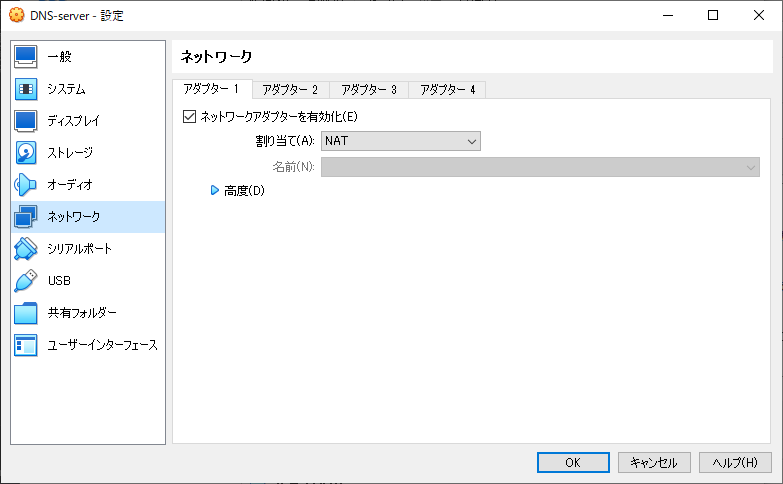

ここで次のように変更します。

- 割り当てを「ブリッジアダプター」に変更します。
- 名前を確認します。今回はホスト側と仮想マシンの両方を 192.168.0.0/24 に参加させる予定なので、ホストが 192.168.0.0/24 に参加するために使用しているネットワークカードが選択されていればOKです。

上記のように変更したら「OK」をクリックして設定を確定しましょう。

### 次のステップへ

これで、空っぽの仮想マシンを準備できました。次のステップではこの仮想マシンに OS をインストールします。

## 仮想マシンへのOSインストール

このステップでは、前のステップで作成した空の仮想マシンへOSをインストールします。

### インストーラーの起動

まず、前回作成した仮想マシンを起動しましょう。下図で示すボタンをクリックしてください。仮想マシンが起動するので少し待ちましょう。

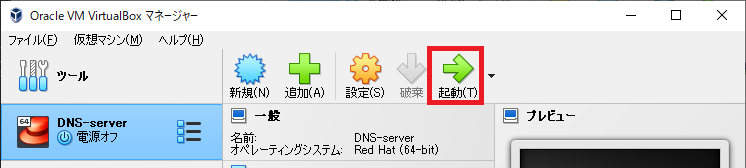

少し待つと下図の画面が表示されます。

<aside class="pisitive">

仮想マシンのウィンドウをクリックすると、マウスやキーボード入力が仮想マシンへ入力される状態になります。解除するためには、右の Ctrl キーを押しましょう。
</aside>

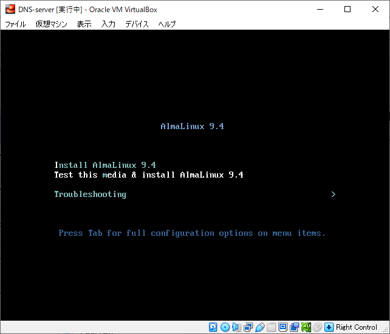

「Test this media & instal AlmaLinux」が選択されているので Enter キーを入力しましょう。あるいは、何も入力せずに1分待っても同じように先へ進めます。

下図のように文字列が表示され、ディスクのチェックが始まります。そのまま待ちましょう。

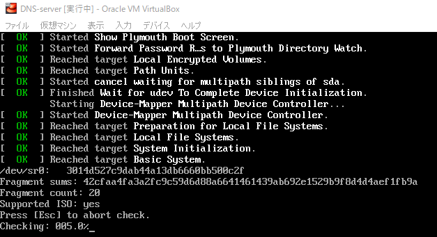

チェックが終わるとさらに文字列が表示された後、下図の画面が表示されます。

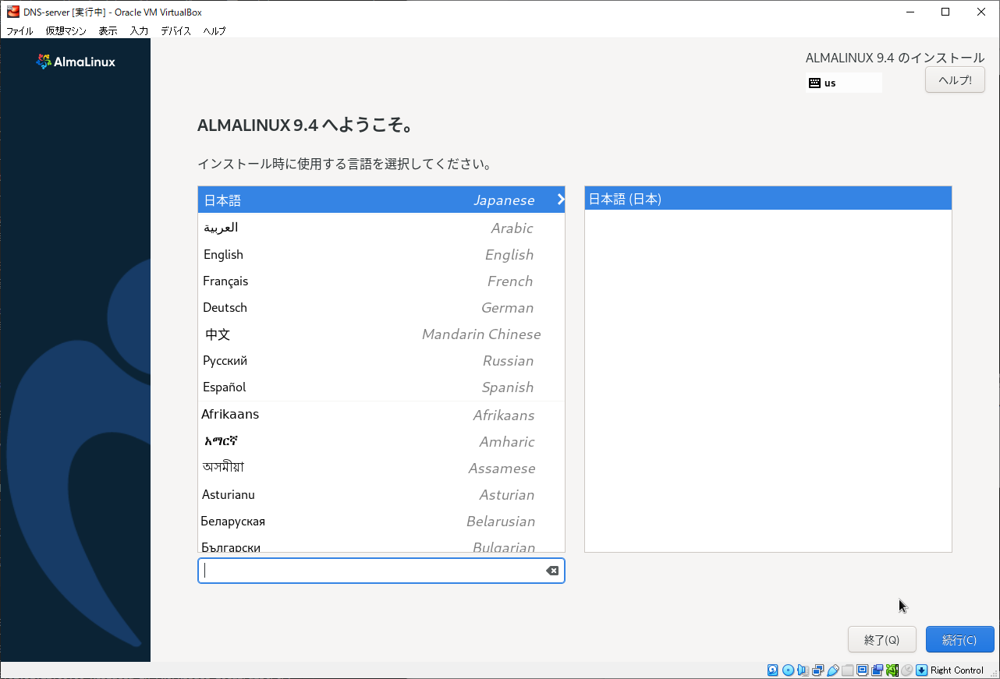

### 言語の選択

まずインストーラが使用する言語を指定します。問題が無ければこのまま右下の「続行」をクリックします。

少し待つと、下図の画面が表示されます。

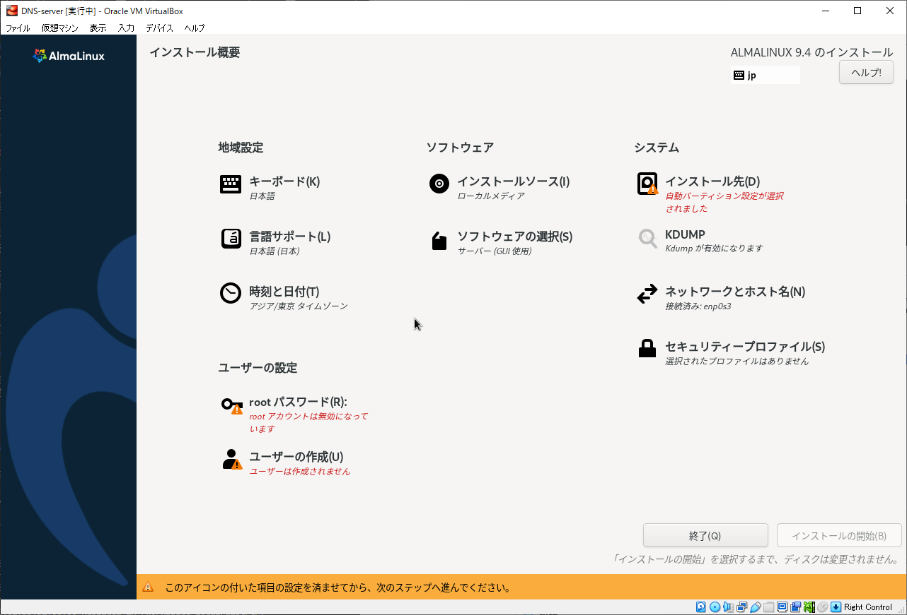

### ユーザの作成

最低限1つのユーザを作成する必要があります。「ユーザの作成」をクリックすると下図の画面が表示されるため、下記のように設定します。

- フルネームとユーザ名は、ここでは admin としました。
- 「このユーザを管理者にする」にチェックを入れます。最低限、1つの管理者ユーザかルートユーザが必要です。
- 「このアカウントを使用する場合にパスワードを要求する」にチェックを入れます。要求しなくてもDNSサーバを構築できますが、セキュリティ事故を防ぐためパスワードを要求するようにします。
- パスワード欄には、このユーザのログインに使用するパスワードを入力します。

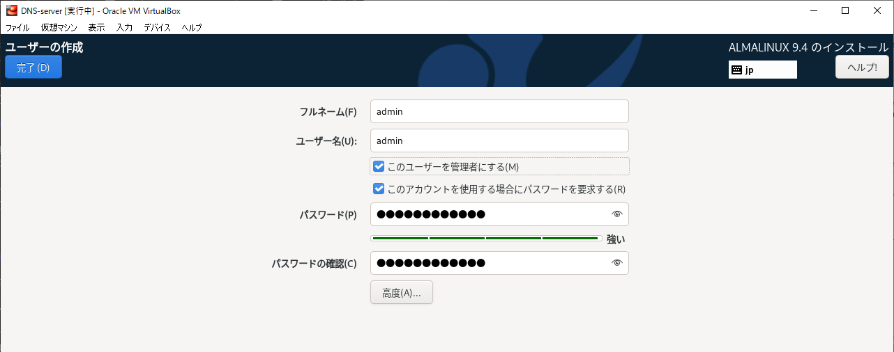

入力したら、左上の「完了」をクリックすることで前の画面に戻ります。

### パーティションの設定

「インストール先」にも赤色のメッセージが表示されているため操作が必要ですが、仮想マシンへインストールする際は、通常、設定変更の必要がありません。そのため、次の手順を実施して赤字のメッセージを解消するだけで問題ありません。

1. 「インストール先」をクリックすることで、インストール先の設定画面へ移動する。
2. 左上の「完了」をクリックすることで、前の画面に戻る。
3. 少し待ち、「インストール先」に表示されていた赤字のメッセージが消え、新たに赤字のメッセージが表示されないことを確認する。

### ソフトウェアの選択

次にOSとともにインストールするソフトウェアを選択します。「ソフトウェアの選択」をクリックすると、下図のような画面が表示されます。次のように設定します。

- 左の一覧の「サーバー (GUI 使用)」をクリックします
- 右の一覧の「DNS ネームサーバー」にチェックを付けます。

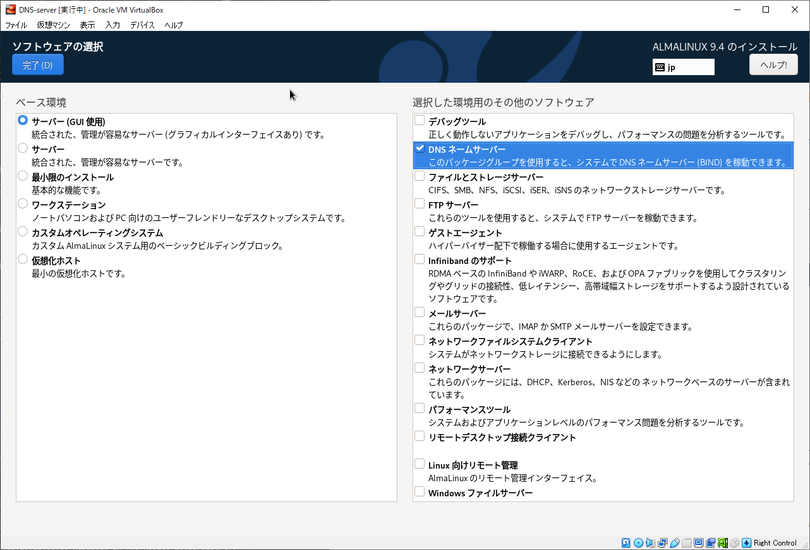

入力したら、左上の「完了」をクリックすることで前の画面に戻ります。

<aside class="negative">
ここで「サーバー」を選んでもハンズオンを進めることはできますが、問題が起きたときはコマンドでの調査・解決が必要になるため Linux マシンの管理に精通していない場合はお勧めしません。GUI 使用のインストールをお勧めします。
</aside>

### ネットワークの設定

次に、ゲストOSのネットワークを設定します (物理層にあたる部分は仮想マシンの設定として設定済みですが、ここでは論理的な部分を設定します)。「ネットワークとホスト名」をクリックすると、下図のような画面が表示されます。

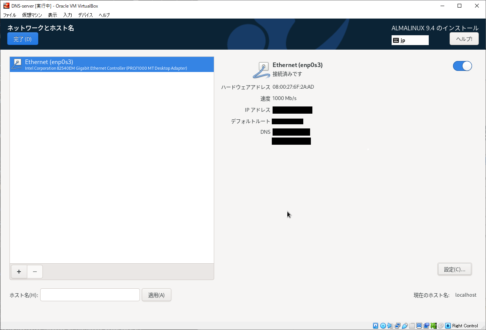

右下の「設定」ボタンをクリックすると、下図のような画面が表示されます。

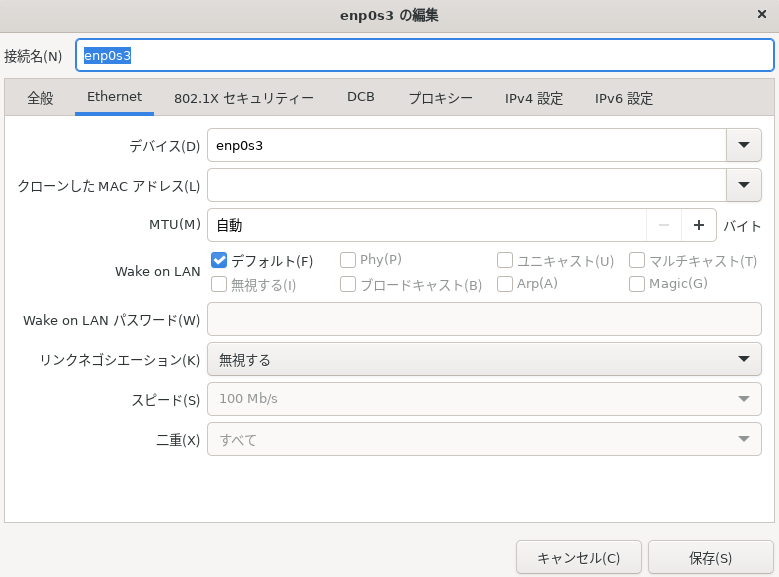

「IPv4 設定」をクリックすると、下図のような画面が表示されます。下記のように設定します。

- メソッドを「手動」にします
- アドレスの「追加」ボタンをクリックし、入力欄に「192.168.0.101」(DNS サーバに割り当てるIPアドレス)、「24」、「192.168.0.1」を入力します。
- DNS サーバーはここでは 8.8.8.8 としました。

<aside class="negative">
ここでの設定値はネットワークの都合に合わせて適宜変更してください。
</aside>

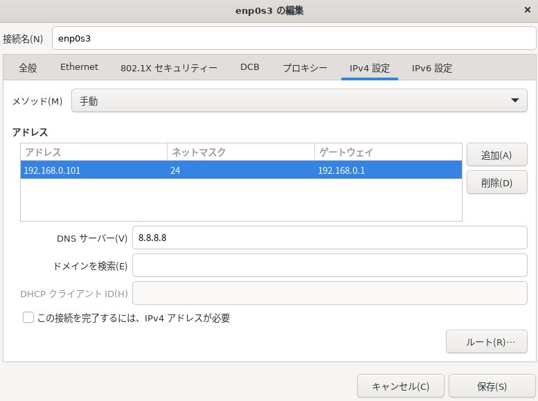

入力したら、右下の「保存」をクリックし、左上の「完了」をクリックすることで前の画面に戻ります。

### インストールの開始

ここまでの設定がすべて完了したら、実際にインストールを開始しましょう。下図の画面の右下の「インストールの開始」ボタンをクリックすることで、インストールが始まります。

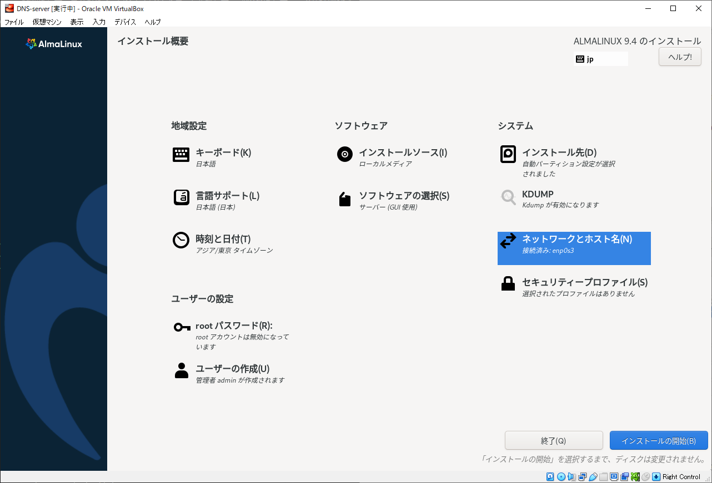

しばらく待つとインストールが完了して下図のような画面になります。

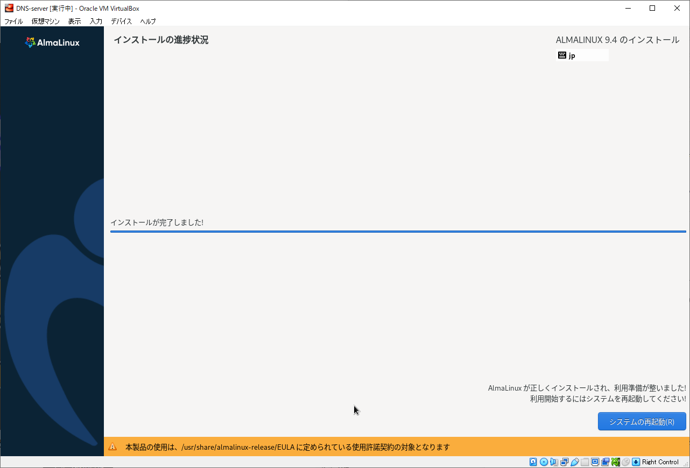

右下の「システムの再起動」ボタンをクリックしましょう。仮想マシンが再起動し、インストールしたOSが起動します。

### ネットワーク接続の確認

OSが起動すると下図の画面が表示されます。

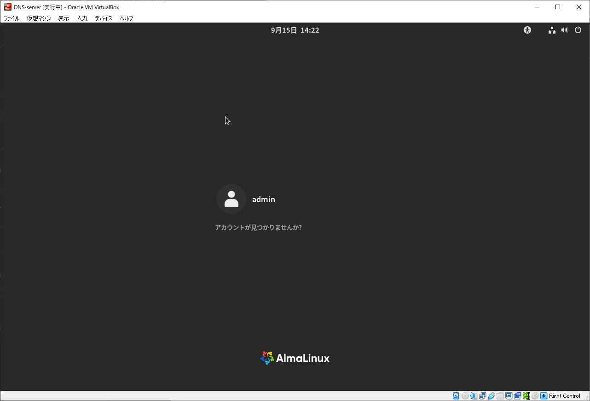

この状態で、ホスト側 (もしくは他の端末) の Powershell で次のコマンドを実行することで、仮想マシンとの疎通を確認しましょう。

```powershell
ping 192.168.0.101
```

192.168.0.101 からの応答があれば成功です。応答がない場合、仮想マシンかゲストOS (AlmaLinux) のネットワーク設定が誤っている可能性があります。下記の手順で見直してください。

1. 仮想マシンの現在のネットワーク設定は、設定時の手順をたどることで確認・変更することができます。
2. ゲスト OS のネットワーク設定は、ログイン画面でログインした後、右上の  から確認・変更することができます。


## DNS サーバ立ち上げ

前のステップでは OS を仮想マシンにインストールし、ログイン画面まで進みました。ここからはこの仮想マシンを DNS として使用できるように設定します。

### ログイン

まずはインストール時に作成したユーザ admin としてログインしましょう。画面中央の admin をクリックするとパスワード入力欄が表示されるので、そこにインストール時に設定したパスワードを入力しましょう。

初めてログインすると下図の画面が表示されます。このハンズオンでは「必要ありません」をクリックして先に進みましょう。

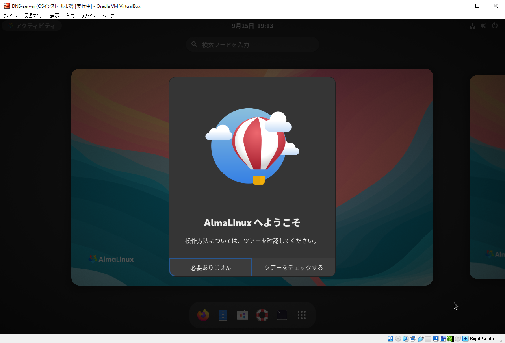

### 端末の起動

ここからはコマンドを用いて設定を進めます。そのために画面下部のアプリリストの  をクリックすることで、下図の端末を起動しましょう。もしアプリリストを閉じてしまった場合、画面左上の「アクティビティ」をクリックすることでアプリリストを再度表示できます。

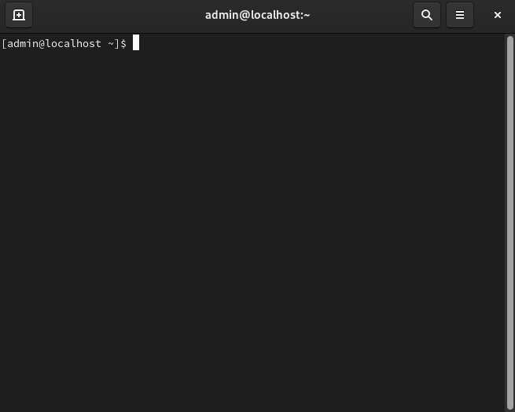

<aside class="positive">
このハンズオンでは上記の端末ウィンドウを使用しますが、ホストOS (または他の端末) から ssh で接続してそこから以降の作業を実施しても構いません。このハンズオンと同じ手順で AlmaLinux をインストールした場合、デフォルトで SSH 接続が可能になっています。
</aside>

### root に昇格

この先の操作は管理者権限を要するものばかりなので、以降の操作全てを root として実行できるようにするために下記のコマンドを実行します。

```console
sudo -s
```

すると、警告メッセージとともにパスワードの入力が要求されるため、admin ユーザのパスワードと Enter キーを入力しましょう。下図のように `[root@ ... #` と表示されたら成功です。以降の操作は root 権限をもつ者として実行されます。

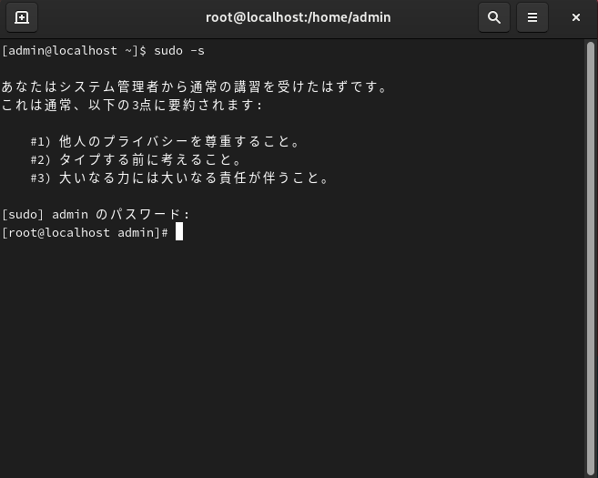

### DNS サーバの状態の確認

まず一度、DNS サーバに問い合わせをしてみましょう。端末で次のコマンドを実行します。

```console
dig @127.0.0.1 www.google.com
```

このコマンドは 127.0.0.1 (つまりゲストOS自身) へ `www.google.com` の IP アドレスを問い合わせます。しかし、今は `connection timed out` のメッセージとともに失敗するはずです。なぜならまだ DNS サーバのサービス (`named.service`) を起動していないためです。

`named.service` が起動していないことは下記のコマンドで確かめられます。

```console
systemctl status named
```

このコマンドを実行すると次のような表示がされます。

```plaintext
named.service - Berkeley Internet Name Domain (DNS)
    Loaded: loaded (/usr/lib/systemd/system/named.service; disabled; preset: disabled)
    Active: inactive (dead)
```

Active 欄が inactive なので動作していないことがわかります。

<aside class="positive">
上記の手順はトラブル発生時、解決の糸口となる原因を探るために有効です。上記の操作で、DNS サービスそのものが動作している (active) のか動作していないのか (inactive) がわかります。
</aside>

### DNS サービスの起動

では DNS サービスを起動してみましょう。次のコマンドを実行します。

```console
systemctl start named
```

何もメッセージが出力されなければ成功です。続けて、下記のコマンドで名前解決を試してみましょう。

```console
dig @127.0.0.1 www.google.com
```

先ほど失敗したときと同様にテキストが出力されますが、今回はその中に次のような文字列が出力され、www.google.com の IP アドレスを取得できた、つまり名前解決に成功したことがわかります。

```plaintext
;; ANSWER SECTION:
www.google.com.    300   IN   A   142.250.196.100
```

これで DNS サーバの立ち上げを完了できたように思えますが、実はまだ次の課題が残っています。

- この DNS サービス起動は一時的なものです。ゲストOSを再起動すると再び inactive 状態になります。
- この DNS サーバはゲストOS自身からのアクセスにしか応答しません。ファイアーウォールと named の設定によって二重に阻まれています。

続けて、これらの問題を解消しましょう。

### DNS サービスの自動起動

これまでの操作で DNS サービスを起動しましたが、これは一時的なものであり、ゲストOSをシャットダウン・再起動すると再び inactive 状態に戻ってしまいます。以下の手順で、ゲストOS起動時に DNS サービスを自動で起動するように設定しましょう。

手順はただ一つ、次のコマンドを実行するだけです。

```console
systemctl enable named
```

それができたら、下記のコマンドを実行して状態を確認しましょう。

```console
systemctl status named
```

以下のように、Loaded の行が enabled になっているはずです。

```plaintext
named.service - Berkeley Internet Name Domain (DNS)
    Loaded: loaded (/usr/lib/systemd/system/named.service; enabled; preset: disabled)
    Active: inactive (dead)
```

今回は出力が長いためテキスト閲覧モードになっているかもしれません。その場合、q を入力することでテキスト閲覧を終了できます。

これで、DNS サービスが自動で起動するようになりました。

### ファイアーウォールの設定

次に、ファイアーウォールを緩和します。現状の設定では DNS への問い合わせを待ち受けるポート 53 が封じられているため、他の端末 (ホストOSも含む) からゲストOSの DNS への問い合わせを受け付けられません。

そのことを確認するために、下記のコマンドを実行してみましょう。

```console
firewall-cmd --list-all
```

出力の中に 53 番ポートや named がないことがわかります。

そこで、次の2つのコマンドを実行することでポート 53 の開放を設定します。

```console
firewall-cmd --add-service dns --permanent
```

このコマンドで DNS が問い合わせを待ち受ける TCP と UDP の 53 番ポートの開放を設定します。`--permanent` を付けているのでポートを閉鎖するコマンドを実行するまで開放されます。ただし、まだこの設定は反映されていません。

<aside class="positive">

ポート開放は、下記のようにポート番号を指定して実施することもできます。

```console
firewall-cmd --add-port 53/tcp --permanent
firewall-cmd --add-port 53/udp --permanent
```
</aside>

下記のコマンドを実行することで、設定を反映します。

```console
firewall-cmd --reload
```

ここまでできたら、もう一度下記のコマンドを実行して、ポートが開放されたかどうかを確認しましょう。

```console
firewall-cmd --list-all
```

ports の欄に「53/tcp 53/udp」と表示されれば成功です。無事、firewall によるDNSアクセスの遮断を解除することができました。

ただし、named の設定による遮断は解除できていないので、まだ他の端末 (ホストOSを含む) からは DNS へアクセスできないことに注意してください。

### 次のステップへ

次のステップでは named の設定を編集することで、DNSサーバとしてネットワーク内の他の端末から利用できるようにします。

## DNS サーバの初期設定

このステップでは DNS サーバの設定を編集して、他の端末から DNS サーバとして利用できるようにします。

### 設定の編集

ここでは `/etc/named.conf` を編集しますが、その前に次のコマンドで現在の named.conf をコピーしておきましょう。この後の編集時に誤って設定を壊してしまっても元に戻せるようにするためです。

```console
cp -p /etc/named.conf /etc/named.conf.backup
```

では、設定ファイルを編集していきましょう。下記のコマンドでテキストエディタを起動します。

```console
vim /etc/named.conf
```

そして、次の変更を実施します。

- `listen-on` の行を次のように変更します。
    ```
    listen-on port 53 { 127.0.0.1; 192.168.0.101; };
    ```

    これにより、`192.168.0.101` 宛のアクセスを受け付けるようになります。これまでは `127.0.0.1` 宛のアクセスしか受け付けていなかったので、`127.0.0.1` 宛でアクセスできるゲストOS自身しかアクセスするすべがありませんでした。

- `allow-query` の行を次のように変更します。
    ```
    allow-query { localhost; 192.168.0.0/24; };
    ```

    これにより、`192.168.0.0/24` からのアクセスを受け付けるようになります。これまでは自分自身からのアクセスしか受け付けていませんでした。


変更を実施したら、以下のコマンドを実行することで、設定ファイルに構文エラーが無いかをチェックしましょう。

```
named-checkconf
```

なにも出力されなければ成功です。エラーメッセージが出力された場合、そのメッセージにエラー検出箇所が書かれているのでその前後を修正してください。

### 設定の反映と動作確認

これで設定ファイルの編集が完了したので、これを実行中の DNS サービスに反映しましょう。次のコマンドを実行することで、設定ファイルを反映します。

```console
systemctl reload named
```

何も出力が無ければ成功です。

まずはゲストOSからアクセスできるかを確かめてみましょう。下記の2つのコマンドを実行します。

```console
dig @127.0.0.1 www.google.com
dig @192.168.0.101 www.google.com
```

両方とも www.google.com の IP アドレスを出力していれば成功です。

続いて、ホストOS (もしくは他の端末) からも利用できるかを確かめてみましょう。ホストOS (もしくは他の端末) で Powershell を開き、下記のコマンドを実行します。

```powershell
nslookup www.google.com 192.168.0.101
```

IPアドレスが表示されれば成功です。

## 独自の名前解決の登録

このステップではドメイン `myserver.test` を `192.168.0.10` に解決するように DNS サーバを設定します。

### ゾーン設定の追加

まずは前のステップでも編集した設定ファイル `/etc/named.conf` にさらに設定を追加します。下記のコマンドでテキストエディタを起動します。

```console
vim /etc/named.conf
```

そして、末尾に次の文字列を追加します。

```conf
zone "myserver.test" {
        type master;
        file "myserver.test.zone";
        allow-query { 127.0.0.1; 192.168.0.0/24; };
        allow-transfer { none; };
};
```

この設定の意味は次の通りです。

- ドメイン `myserver.test` の権威サーバ (`master`) としてふるまいます。
- 詳細な設定ファイルはこの後作成するゾーンファイル `myserver.test.zone` に記載します。
- このふるまいはゲストOS自身 (`127.0.0.1`) と `192.168.0.0/24` からのアクセス時にのみ有効です。
- ゾーン転送を無効化します。

変更を実施したら、前のステップと同様に、以下のコマンドを実行することで設定ファイルに構文エラーが無いかをチェックしましょう。

```
named-checkconf
```

### ゾーンファイルの作成

次にゾーンファイル `myserver.test.zone` を作成します。下記のコマンドでテキストエディタを起動します。

```console
vim /var/named/myserver.test.zone
```

そして、下記の内容を記載します。

```
$TTL 8h
@ IN SOA myserver.test. postmaster.myserver.test. (
1
1d
3h
3d
3h )

        IN NS   myserver.test.

myserver.test.  IN A    192.168.0.10
```

3行目の `1` はシリアルナンバーです。このファイルの内容を変更する際はこの番号をより大きくなるよう変更してください。

<aside class="positive">

さらに下記の行を追加すると、`sub.myserver.test` を `192.168.0.11` に解決するようになります。

```
sub.myserver.test.  IN A    192.168.0.11
```

このサーバは `myserver.test` の権威サーバとしてふるまうように設定されているため、そのサブドメイン (`.myserver.test` で終わるドメイン) の名前解決も登録できるのです。
</aside>

上記の内容を記載したら、ファイルのパーミッションを変更します。作ったばかりのファイルは OS のデフォルトのパーミッションが設定されていて適切ではないためです。以下のコマンドを実行することで、ゾーンファイルの所有グループとパーミッションを変更してください。

```console
chown root:named /var/named/myserver.test.zone
chmod 640 /var/named/myserver.test.zone
```

この変更によって、編集は `root` ユーザのみ可能、読み込みは `root` ユーザと `named` グループのみ可能となり、それ以外の者による読み書きから守られます。

以上の変更を実施したら、以下のコマンドを実行することで設定ファイルに構文エラーが無いかをチェックしましょう。

```
named-checkzone myserver.test /var/named/myserver.test.zone
```


### 設定の反映と動作確認

これで設定ファイルの編集が完了したので、これを実行中の DNS サービスに反映しましょう。次のコマンドを実行することで、設定ファイルを反映します。

```console
systemctl reload named
```

何も出力が無ければ成功です。

まずはゲストOSから `myserver.test` を解決できるかを確かめてみましょう。下記の2つのコマンドを実行します。

```console
dig @127.0.0.1 myserver.test
dig @192.168.0.101 myserver.test
```

両方とも先ほど設定した `myserver.test` の IP アドレスを出力していれば成功です。

続いて、ホストOS (もしくは他の端末) からも利用できるかを確かめてみましょう。ホストOS (もしくは他の端末) で Powershell を開き、下記のコマンドを実行します。

```powershell
nslookup myserver.test 192.168.0.101
```

こちらにも同じIPアドレスが表示されれば成功です。
